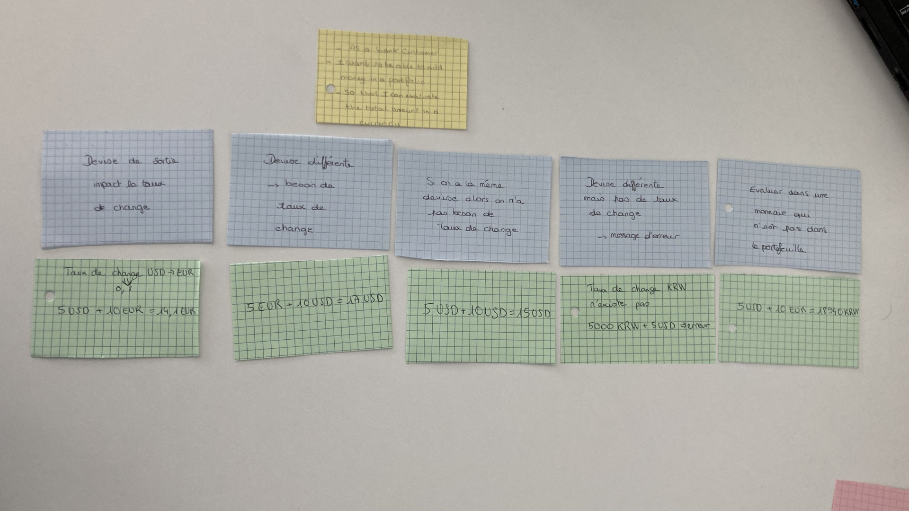

# Example Mapping

## Format de restitution
*(rappel, pour chaque US)*

```markdown
## Titre de l'US (post-it jaunes)

> Question (post-it rouge)

### Règle Métier (post-it bleu)

Exemple: (post-it vert)

- [ ] 5 USD + 10 EUR = 17 USD
```

Vous pouvez également joindre une photo du résultat obtenu en utilisant les post-its.

## Évaluation d'un portefeuille

## Titre de l'US (post-it jaunes)
As a Bank Customer <br>
I want to be able to add money in a portfolio <br>
So that I can evaluate the total amount in a currency

### Taux de change déterminé par la devise de sortie

Exemple: (post-it vert) <br>
TC EUR -> USD = 1.2 donc USD -> EUR = 0.8
- [ ] 5 USD + 10 EUR = 14.1 EUR

### Devise différentes => besoin de taux de change

Exemple: (post-it vert)
- [ ] 5 USD + 10 EUR = 17 USD

### Devise différente mais pas de taux de change

Exemple: (post-it vert) <br>
Taux de change vers KRW n'existe pas
- [ ] 5 USD + 10 EUR => erreur

### Devise identique => pas besoin de taux de change

Exemple: (post-it vert)
- [ ] 5 USD + 10 USD = 15 USD

### Evaluer dans une monnaie qui n'est pas dans le porte-monnaie

Exemple: (post-it vert)
- [ ] 5 USD + 10 EUR = 18940 KRW


